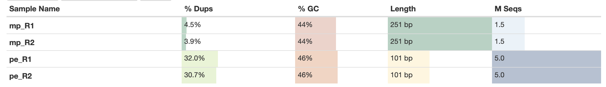
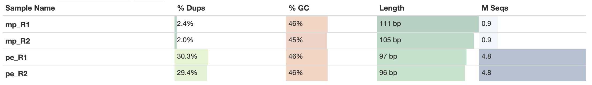
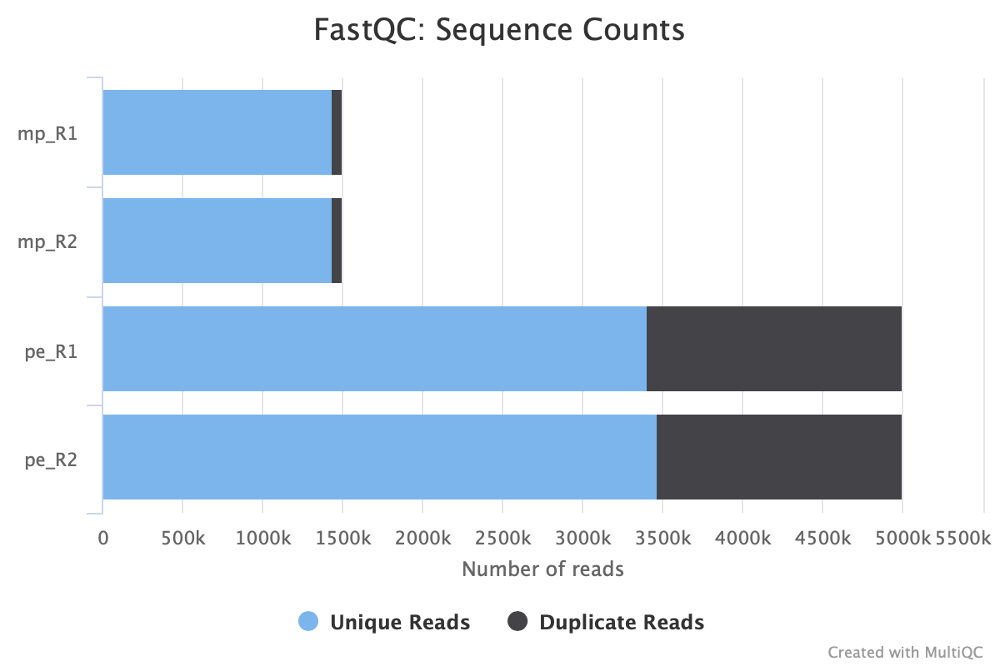
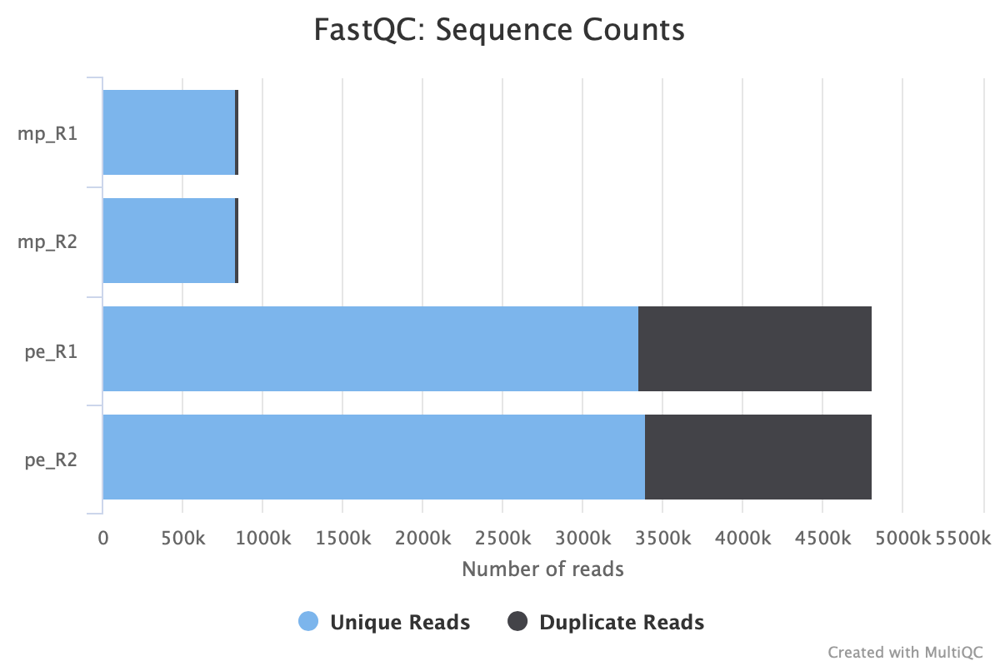
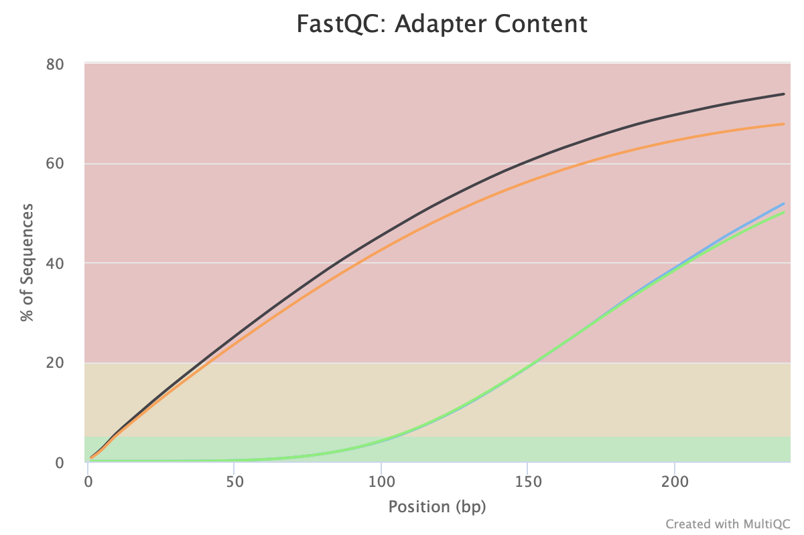
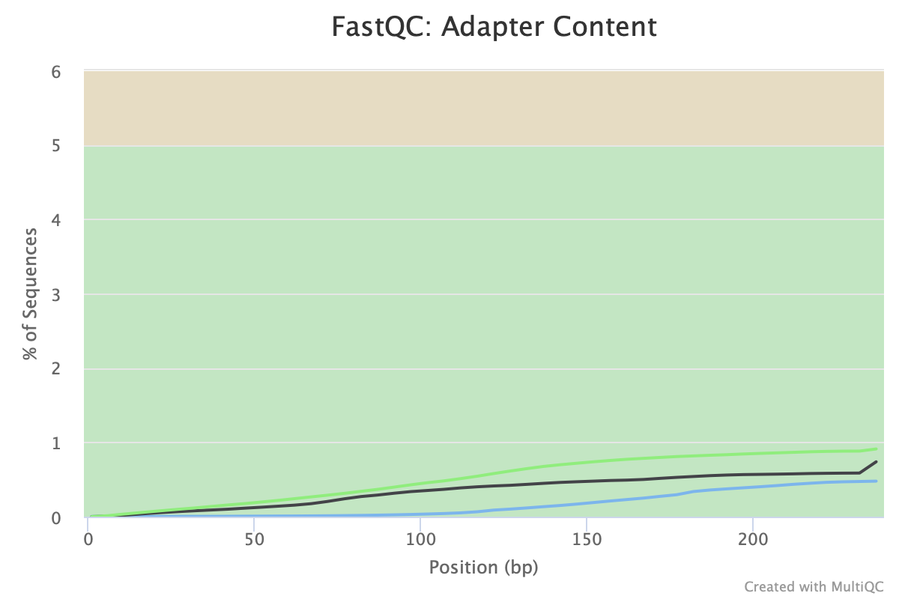

# Домашнее задание 1
1) Создаем папку с домашним заданием и линкуем сырые данные:
```
mkdir hw1
cd hw1
ls -1 /usr/share/data-minor-bioinf/assembly/* | xargs -tI{} ln -s {}
```
2) Выбираем случайные риды, удаляем ненужные файлы:
```
seqtk sample -20 oil_R1.fastq 5000000 > pe_R1.fastq
seqtk sample -s20 oil_R2.fastq 5000000 > pe_R2.fastq
seqtk sample -s20 oilMP_S4_L001_R1_001.fastq 1500000 > mp_R1.fastq
seqtk sample -s20 oilMP_S4_L001_R2_001.fastq 1500000 > mp_R2.fastq

rm -r oil_R1.fastq
rm -r oil_R2.fastq
rm -r oilMP_S4_L001_R1_001.fastq
rm -r oilMP_S4_L001_R2_001.fastq
```
3) Оцениваем качество для наших чтений с помощью fastQC и multiQC:
```
mkdir fastqc
ls *.fastq | xargs -P 4 -tI{} fastqc -o fastqc {}

mkdir multiqc
multiqc -o multiqc fastqc
```

4) Обрезаем чтение по качеству и убираем праймеры:
```
platanus_trim pe_R1.fastq pe_R2.fastq 
platanus_internal_trim mp_R1.fastq mp_R2.fastq  
```

5) Оцениваем качество для наших новых(обрезанных) чтений:
```
mkdir trimmed
mv -v *trimmed trimme/
mkdir trimmed_fastqc
ls trimmed/* | xargs -P 4 -tI{} fastqc -o trimmed_fastqc {}
mkdir trimmed_multiqc
multiqc -o trimmed_multiqc trimmed_fastqc
```
До:

После:


До:

После:


До:

После:


До:

После:



6) Cобираем контиги из обрезанных чтений:
```
time platanus assemble -o Poil -f trimmed/pe_R1.fastq.trimmed trimmed/pe_R2.fastq.trimmed 2> assemble.log
```
7) Анализ полученных контигов:

jupyter_notebook

8) Собираем скаффолды:
```
time platanus scaffold -o Poil -c Poil_contig.fa -IP1 trimmed/pe_R1.fastq.trimmed  trimmed/pe_R2.fastq.trimmed -OP2 trimmed/mp_R1.fastq.int_trimmed trimmed/mp_R2.fastq.int_trimmed 2> scaffold.log
```
9) Анализ полученных скаффолдов + количество гэпов: см в jupyter notebook.

Создаем файл с одним самым большим размером:
```
echo scaffold1_len3834022_cov231 > scaff.txt
seqtk subseq Poil_scaffold.fa scaff.txt > Scaff.fna
rm -r scaff.txt
```

10) Уменьшаем кол-во гэпов:
```
time platanus gap_close -o Poil -c Poil_scaffold.fa -IP1 trimmed/pe_R1.fastq.trimmed  trimmed/pe_R2.fastq.trimmed -OP2 trimmed/mp_R1.fastq.int_trimmed trimmed/mp_R2.fastq.int_trimmed 2> gapclose.log
```
11) Анализ полученных скаффолдов с уменьшением гэпов: см. в jupyter notebook.

Создаем файл с одним самым большим размером:
```
echo scaffold1_cov231 > scaff.txt
seqtk subseq Poil_gapClosed.fa name_scaff.txt > longest_scaff.fna
rm -r scaff.txt
```

